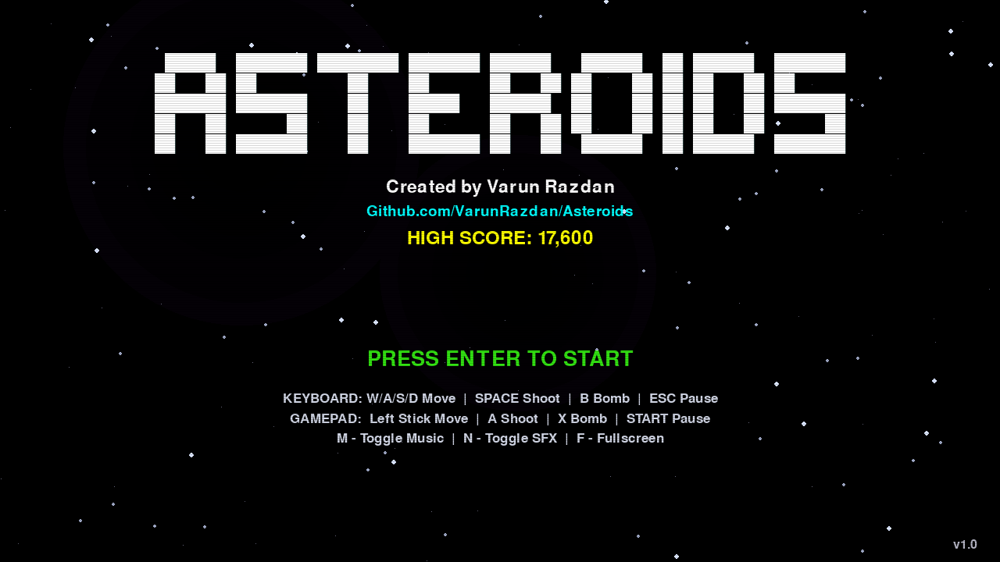
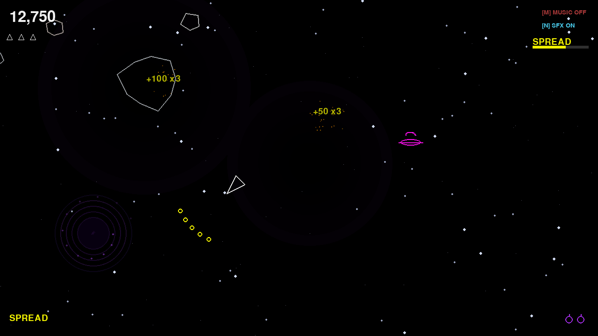
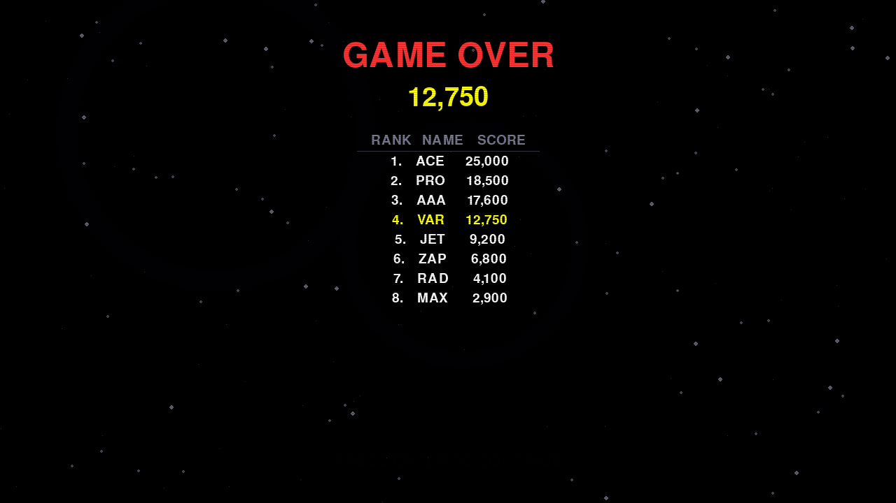

# ASTEROIDS

```
    _    ____ _____ _____ ____   ___  ___ ____  ____
   / \  / ___|_   _| ____|  _ \ / _ \|_ _|  _ \/ ___|
  / _ \ \___ \ | | |  _| | |_) | | | || || | | \___ \
 / ___ \ ___) || | | |___|  _ <| |_| || || |_| |___) |
/_/   \_\____/ |_| |_____|_| \_\\___/|___|____/|____/
```

A classic Asteroids arcade game reimagined with retro neon aesthetics, acceleration-based physics, power-ups, procedural visuals, and chiptune audio — all built from scratch in Python with pygame.

**Created by Varun Razdan**

---

## Screenshots





---

## Download & Play

### Standalone App (macOS) — No Python Required

Download the latest release from the [Releases](https://github.com/VarunRazdan/Asteroids/releases) page, unzip, and double-click **Asteroids.app** to play.

Or build it yourself:

```bash
git clone https://github.com/VarunRazdan/Asteroids.git
cd Asteroids
uv sync --group dev
uv run pyinstaller --onedir --windowed --name Asteroids \
  --hidden-import=pygame._view --hidden-import=pygame.freetype \
  --hidden-import=numpy main.py
```

The app will be at `dist/Asteroids.app`. High scores are saved to `~/.victor_asteroids/high_scores.json`.

### Run from Source

Requires **Python 3.13+** and [uv](https://docs.astral.sh/uv/).

```bash
git clone https://github.com/VarunRazdan/Asteroids.git
cd Asteroids
uv sync
uv run main.py
```

---

## Controls

| Action | Keyboard | Controller |
|--------|----------|------------|
| Thrust | W | Left Stick Up / RT |
| Reverse | S | Left Stick Down |
| Rotate Left | A | Left Stick Left |
| Rotate Right | D | Left Stick Right |
| Shoot | Space | A / RB |
| Bomb | B | X |
| Pause | ESC | Start |
| Toggle Music | M | Y |
| Toggle SFX | N | — |
| Fullscreen | F / F11 | — |
| Confirm / Start | Enter | A |

---

## Features & Enhancements

This game started as a basic Boot.dev Asteroids tutorial (simple circles, no score, no lives, `sys.exit()` on death) and was rebuilt into a full arcade experience.

### Core Gameplay
- **Acceleration-based physics** with momentum, thrust, friction, and speed cap
- **Screen wrapping** for player, asteroids, and shots
- **Procedurally generated lumpy asteroids** — irregular polygons with slow rotation
- **Triangular ship hitbox** using SAT (Separating Axis Theorem) collision
- **3 weapon types**: Single Shot, Spread Shot (5-bullet fan), and Rapid Fire
- **Alien UFOs** — rare enemy craft that fly across the screen and shoot at you (500 pts, 2 hits to kill)
- **Black holes** — gravity wells that pull in nearby objects; fly too close and your ship spirals in with a crushing death animation

### Power-Up System
- **Shield** — absorbs one hit, rotating cyan ring visual (10s)
- **Speed boost** — 1.5x max speed for 8 seconds
- **Weapon upgrades** — spread shot and rapid fire pickups
- **Bombs** — destroy all on-screen asteroids with a shockwave
- **Extra lives** — collect to gain an additional life (max 5)
- Power-ups drop from destroyed asteroids (8%) and aliens (50%)

### Scoring & Progression
- **Point system**: 100/50/20 pts for small/medium/large asteroids, 500 pts for aliens
- **Combo multiplier** — consecutive kills within 2 seconds build up to 5x
- **Persistent top-10 high score board** saved to disk
- **Classic arcade 3-character name entry** — type A-Z, use arrows, or gamepad

### Visual Effects
- **Particle explosions** on asteroid/alien destruction
- **Thrust flame animation** with flickering inner/outer flame
- **Screen shake** on impacts (proportional to size)
- **Screen flash** on death
- **CRT scanline overlay** for retro feel
- **Slow-motion** on bomb detonation
- **Black hole visuals** — concentric rotating rings with accretion particles
- **Parallax starfield background** with nebula patches
- **Neon retro color palette**

### Audio
- **20 programmatically generated retro sound effects** — weapon-specific lasers, 3 explosion sizes, alien sounds, black hole drone/suck/implosion, power-ups, shield, bomb, death, menu, game over
- **Chiptune background music** — procedural 4-bar loop at 140 BPM
- **8-channel audio** with priority mixing
- **Toggle music (M) and SFX (N)** independently

### Input
- **Keyboard** (WASD + Space + B)
- **Xbox/gamepad controller** — left stick, A/X/RB/Start/Y buttons
- **Dual input** — keyboard and controller simultaneously
- **Resizable window + fullscreen** (F key)

### Game States
- **Title screen** with ASCII art, author credit, high score, controls
- **Pause** (ESC / Start)
- **Game over** with 1.5s death delay (explosion visible), scoreboard, name entry
- **Respawning** with 3-second invulnerability

### HUD
- Score with pop animation
- Lives as ship icons
- Combo multiplier
- Power-up timer bars
- Bomb count
- Weapon label
- Music/SFX toggle indicators

---

## Testing

```bash
uv sync --group dev
SDL_VIDEODRIVER=dummy SDL_AUDIODRIVER=dummy uv run pytest -v
uv run ruff check .
```

157 automated tests (unit, integration, system, security) + CI/CD via GitHub Actions.

---

## Tech Stack

- **Python 3.13** + **pygame 2.6.1** + **numpy**
- **uv** for dependency management
- **PyInstaller** for standalone macOS app
- **pytest** (157 tests) + **ruff** for linting
- **GitHub Actions** for CI/CD

---

## License

MIT
